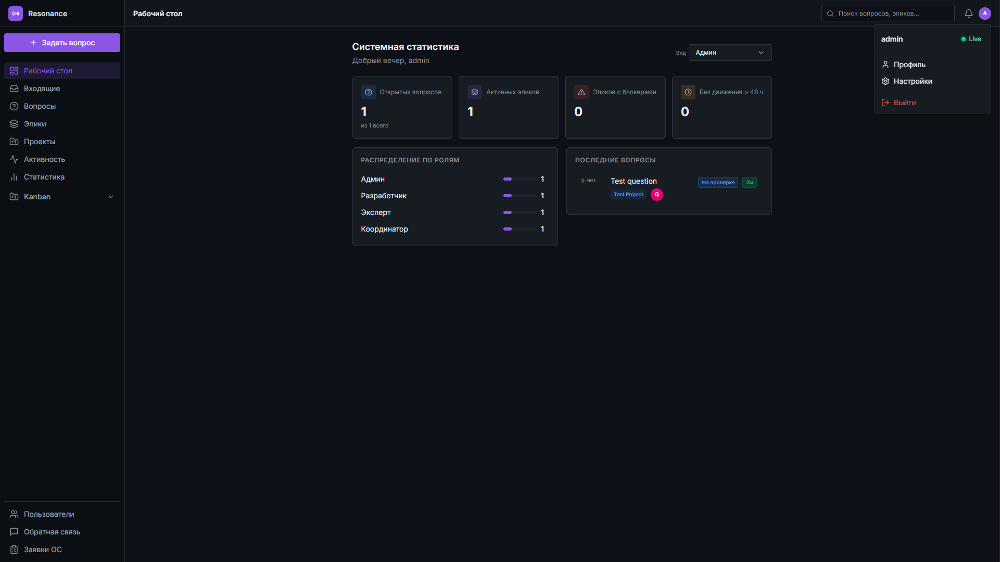
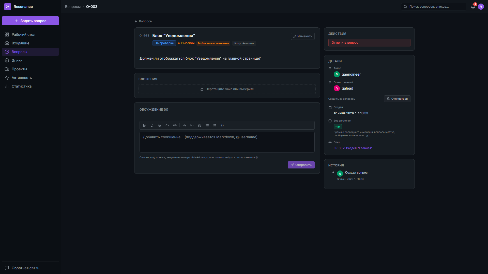
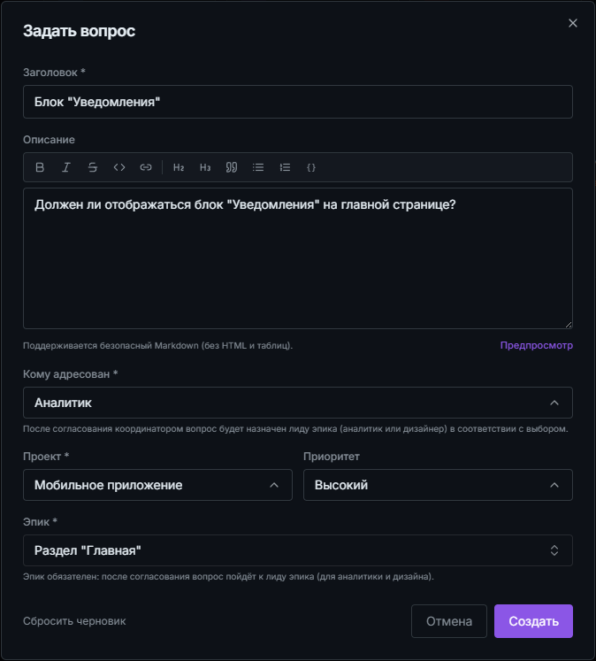
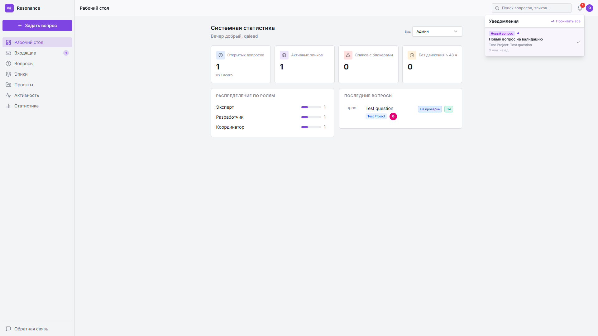
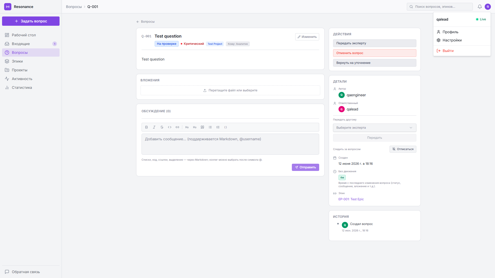

# Resonance

> Resonance появился потому, что автора окончательно заебало искать вопрос №76 в таблице и вручную маршрутизировать его между чатами.

Resonance — система маршрутизации вопросов и накопления экспертных знаний внутри команды.
Проект появился из простой проблемы: важные вопросы терялись в рабочих чатах, эксперты отвечали на одни и те же вещи повторно, а новым сотрудникам было сложно понять, к кому обращаться.
Resonance помогает сохранять знания команды, снижать количество повторяющихся обсуждений и делать рабочие процессы более прозрачными.

---

## Статус проекта

* Версия: **v1.0**
* Статус: **Public Preview**
* Проект находится в активной разработке
* API и схема данных могут изменяться до стабилизации версии v1.x
* Обратная связь, предложения и сообщения об ошибках приветствуются

---

## Почему появился Resonance

Типичный сценарий выглядел так:

1. QA пишет: "Посмотри вопрос №76".
2. Лид открывает таблицу.
3. Ищет нужную строку.
4. Определяет ответственного.
5. Пересылает вопрос в другой чат.
6. Контролирует получение ответа.

Когда таких вопросов десятки в неделю, это превращается в отдельную работу.

Resonance помогает избавиться от этой рутины:

* Вопросы больше не теряются в рабочих чатах.
* Экспертные ответы сохраняются и доступны всей команде.
* Новые сотрудники быстрее находят нужную информацию.
* Руководители получают прозрачную картину по блокерам и узким местам.
* Команда перестаёт задавать одни и те же вопросы повторно.
* Контекст обсуждений сохраняется вместе с принятыми решениями.
* Время лидов и экспертов тратится на решение проблем, а не на ручную маршрутизацию.

---

## Возможности

### Управление вопросами

* создание и маршрутизация вопросов;
* назначение ответственных;
* статусы и история изменений;
* хранение обсуждений и решений.

### Уведомления

* встроенные уведомления в интерфейсе;
* доставка сообщений в Matrix;
* доставка сообщений в Telegram;
* автоматические дайджесты.

### Накопление знаний

* сохранение экспертных ответов;
* повторное использование накопленного опыта;
* снижение зависимости от конкретных сотрудников.

### QA и релизные процессы

* эпики и QA-блоки;
* тестовые прогоны;
* блокеры;
* release planning;
* аналитика и сводки.

### Интеграции

* Custom Kanban integration;
* Matrix;
* Telegram;
* S3-compatible storage.

---

## Скриншоты

<details>
<summary><strong>Тёмная тема</strong></summary>

### Главная


### Страница вопроса


### Создание вопроса


</details>

<details>
<summary><strong>Светлая тема</strong></summary>

### Главная


### Страница вопроса

</details>

---

## Пример использования

1. Сотрудник сталкивается с вопросом.
2. Создаёт его в Resonance.
3. Вопрос автоматически направляется нужным экспертам.
4. Эксперт отвечает.
5. Ответ сохраняется.
6. В следующий раз команда находит готовое решение без повторного обращения.

---

## Технологический стек

### Backend

* Python 3.11
* FastAPI
* SQLAlchemy
* Alembic
* PostgreSQL

### Frontend

* React 18
* Vite
* TypeScript
* TanStack Query
* Tailwind CSS

### Infrastructure

* Docker Compose
* Caddy
* nginx
* MinIO

### CI/CD

* GitHub Actions
* Docker Buildx
* Trivy
* SBOM
* cosign

---

## Архитектура

```text
Frontend
    │
    ▼
Gateway (Caddy)
    │
    ▼
Backend (FastAPI)
    │
    ├─ PostgreSQL
    └─ S3-compatible Storage (MinIO)
```

---

## Структура репозитория

```text
backend/             FastAPI API, миграции, сервисы и тесты
frontend/            React/Vite приложение
deploy/local/        локальный Docker Compose профиль
deploy/production/   production-конфигурация
deploy/docker/       Dockerfile для production-образов
backend/docs/        техническая документация
```

---

## Быстрый локальный запуск

Из корня репозитория:

```bash
docker compose \
  -f deploy/local/docker-compose.local.yml \
  --env-file deploy/local/.env.example \
  up -d --build
```

После запуска доступны:

* Приложение: http://localhost:8080
* Backend Health: http://localhost:8000/health
* MinIO Console: http://localhost:9001

### Учётная запись по умолчанию

Логин:

```text
admin
```

Пароль:

```text
adminadmin
```

---

## Локальная настройка

Для использования собственных параметров окружения:

```bash
cp deploy/local/.env.example deploy/local/.env.local

docker compose \
  -f deploy/local/docker-compose.local.yml \
  --env-file deploy/local/.env.local \
  up -d --build
```

Никогда не коммитьте:

```text
.env
.env.local
.env.production
```

и любые реальные секреты.

---

## Проверки

### Backend

```bash
cd backend
python -m pip install -r requirements.txt
python -m pytest
```

### Frontend

```bash
cd frontend
npm ci
npm run typecheck
npm run lint
npm run test:run
npm run build
```

### Production Compose

```bash
docker compose \
  -f deploy/production/docker-compose.production.yml \
  --env-file deploy/production/.env.example \
  config
```

---

## Production Deploy

Resonance v1.0 разворачивается только как image-only deploy.

Последовательность релиза:

1. Собрать immutable Docker images через release workflow.
2. Опубликовать образы в registry.
3. Подготовить приватный `.env.production`.
4. Выполнить резервное копирование.
5. Запустить миграции.
6. Обновить сервисы.

Исходный код не должен копироваться на production-сервер.

---

## Ограничения v1.0

* realtime SSE использует in-memory bus и требует запуска backend с одним worker;
* вложения используют прямые UUID-ссылки через S3-compatible storage;
* приватизация вложений запланирована на следующую версию;
* Redis/pubsub для горизонтального масштабирования запланирован на v1.1;
* дополнительное усиление безопасности пользовательских токенов вынесено в последующие релизы.

---

## Безопасность

Перед публичной публикацией рекомендуется:

* выполнить secret scan текущего дерева и Git history;
* ротировать секреты, если они когда-либо попадали в логи или архивы;
* использовать актуальный `SECURITY.md`;
* сообщать об уязвимостях через приватный канал, указанный в `SECURITY.md`.

---

## Вклад в проект

Issues, предложения и pull request приветствуются.

Перед отправкой изменений рекомендуется:

1. Запустить локальные проверки.
2. Убедиться, что Docker-конфигурация валидна.
3. Описать цель изменений и возможные последствия.

---

## Лицензия

Лицензия проекта определяется файлом `LICENSE`.

До появления файла `LICENSE` использование, изменение и распространение проекта не разрешены.

---

Resonance создаётся как инструмент для снижения коммуникационных потерь и накопления знаний внутри команды. Проект развивается на основе практического опыта работы с QA-процессами, релизами и межкомандным взаимодействием.
